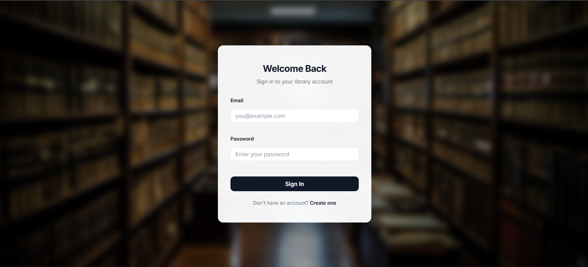
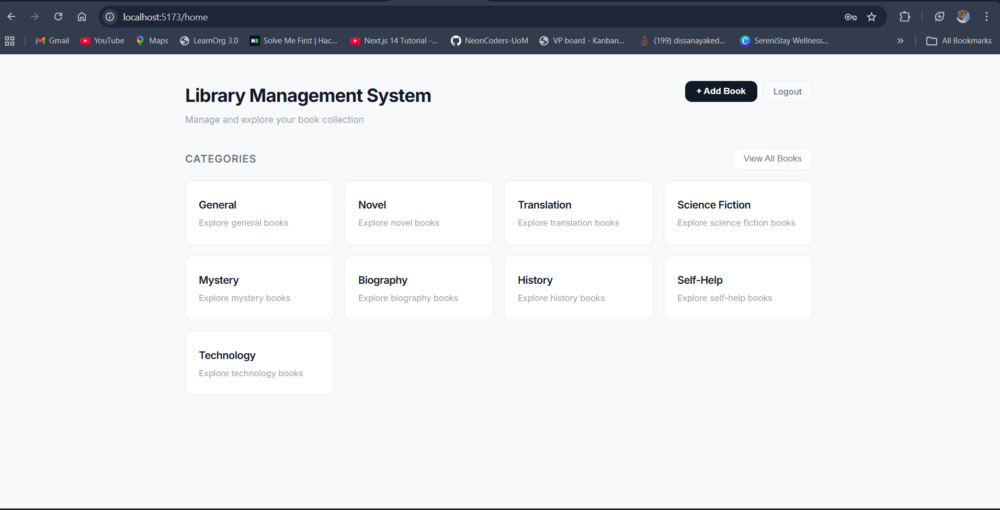
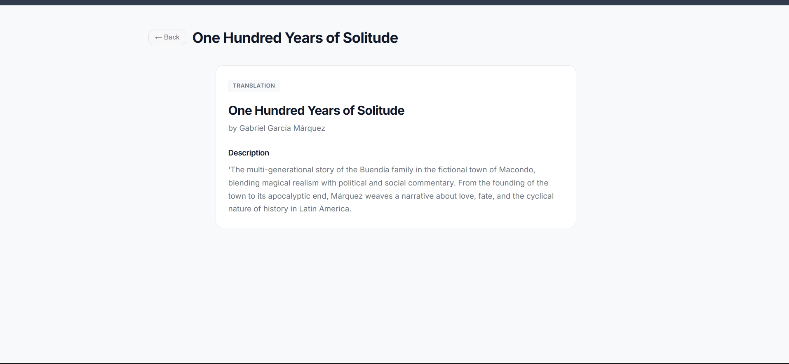
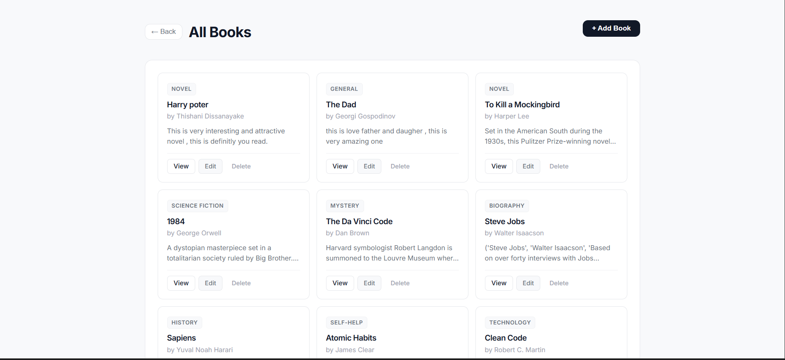

# 📚 Library Management System

A modern, full-stack Library Management System built with React and ASP.NET Core. Features a clean, professional UI with complete CRUD operations, category-based navigation, user authentication, and a responsive design.


## ✨ Features

### Core Functionality
- ✅ **Complete CRUD Operations** - Create, Read, Update, and Delete books
- 📖 **Book Management** - Add books with title, author, description, and category
- 🏷️ **Category System** - 9 predefined categories (Novel, Translation, Science Fiction, Mystery, Biography, History, Self-Help, Technology, General)
- 🔍 **Category Filtering** - Browse books by specific categories
- 📄 **Book Details** - Dedicated page for viewing complete book information
- 📝 **Description Preview** - Smart truncation with "see more" expansion

### User Experience
- 🔐 **User Authentication** - Secure registration and login system
- 👤 **User Sessions** - Persistent login with localStorage
- 🎨 **Professional UI** - Clean, minimal design inspired by Notion/Linear
- 📱 **Responsive Design** - Works seamlessly on all screen sizes
- 🖼️ **Beautiful Auth Pages** - Library-themed background with frosted glass effect
- ⚡ **Fast Navigation** - Client-side routing with React Router

### Technical Features
- 🔄 **RESTful API** - Well-structured backend endpoints
- 💾 **Database** - SQLite with Entity Framework Core
- 🔒 **Password Security** - SHA256 hashing for user credentials
- 🌐 **CORS Enabled** - Configured for frontend-backend communication
- 🎯 **TypeScript** - Type-safe frontend code

## 🖥️ Screenshots

### Login Page

*Elegant authentication with library-themed background*

### Home Dashboard

*Category grid for intuitive book browsing*

### Book Detail View

*Complete book information with clean layout*

### Category View

*Filtered book list with edit and delete options*

## 🛠️ Tech Stack

### Frontend
- **Framework:** React 19
- **Language:** TypeScript 5.9
- **Build Tool:** Vite 7.3
- **Routing:** React Router DOM
- **HTTP Client:** Axios 1.13
- **Styling:** CSS3 with Custom Properties
- **Font:** Inter (Google Fonts)

### Backend
- **Framework:** ASP.NET Core 9.0
- **Language:** C# 13
- **Database:** SQLite
- **ORM:** Entity Framework Core 9.0
- **API:** RESTful Web API

## 📋 Prerequisites

Before running this project, ensure you have:

- **Node.js** 18+ and npm
- **.NET SDK** 9.0 or higher
- **Git** (for cloning the repository)
- A modern web browser

## 🚀 Getting Started

### 1. Clone the Repository

```bash
git clone <repository-url>
cd LibraryManagementSystem
```

### 2. Backend Setup

```bash
# Navigate to backend directory
cd backend

# Restore dependencies
dotnet restore

# Apply database migrations
dotnet ef database update

# Run the backend server
dotnet run
```

The backend API will be available at `http://localhost:5116`

### 3. Frontend Setup

Open a new terminal:

```bash
# Navigate to frontend directory
cd frontend

# Install dependencies
npm install

# Start development server
npm run dev
```

The frontend will be available at `http://localhost:5173`

### 4. Load Sample Data (Optional)

To populate the database with 15 sample books:

```bash
# From the backend directory
sqlite3 library.db < ../SampleData.sql
```

Or manually copy and execute the SQL from `SampleData.sql`

## 📁 Project Structure

```
LibraryManagementSystem/
├── backend/
│   ├── Controllers/
│   │   ├── AuthController.cs      # Login & Registration endpoints
│   │   └── BooksController.cs     # CRUD operations for books
│   ├── Data/
│   │   └── AppDbContext.cs        # EF Core database context
│   ├── DTOs/
│   │   └── AuthDtos.cs            # Data transfer objects for auth
│   ├── Helpers/
│   │   └── PasswordHelper.cs      # Password hashing utility
│   ├── Migrations/                # EF Core migrations
│   ├── Models/
│   │   ├── Book.cs                # Book entity model
│   │   └── User.cs                # User entity model
│   ├── Program.cs                 # Application entry point
│   ├── appsettings.json           # Configuration
│   └── backend.csproj             # Project file
│
├── frontend/
│   ├── public/
│   │   └── library.jpg            # Background image for auth pages
│   ├── src/
│   │   ├── components/
│   │   │   ├── BookForm.tsx       # Add/Edit book form component
│   │   │   ├── BookList.tsx       # Book grid display
│   │   │   ├── Button.tsx         # Reusable button component
│   │   │   └── Modal.tsx          # Modal dialog component
│   │   ├── pages/
│   │   │   ├── AddBook.tsx        # Add book page
│   │   │   ├── BookDetail.tsx     # Single book detail page
│   │   │   ├── CategoryBooks.tsx  # Category-filtered book list
│   │   │   ├── Home.tsx           # Home dashboard
│   │   │   ├── Login.tsx          # Login page
│   │   │   └── Register.tsx       # Registration page
│   │   ├── services/
│   │   │   ├── api.ts             # Axios instance for books API
│   │   │   └── authService.ts     # Authentication API calls
│   │   ├── styles/
│   │   │   ├── Auth.css           # Auth pages styling
│   │   │   ├── Books.css          # Book pages styling
│   │   │   ├── Button.css         # Button component styles
│   │   │   ├── Home.css           # Home page styling
│   │   │   └── Modal.css          # Modal component styles
│   │   ├── types/
│   │   │   ├── Auth.ts            # Auth type definitions
│   │   │   └── Book.ts            # Book type definition
│   │   ├── App.tsx                # Root component with routing
│   │   ├── App.css                # Global app styles
│   │   ├── index.css              # CSS reset & design system
│   │   └── main.tsx               # React entry point
│   ├── index.html
│   ├── package.json
│   ├── tsconfig.json
│   └── vite.config.ts
│
├── SampleData.sql                 # 15 sample books
├── LibraryManagementSystem.sln    # Visual Studio solution
└── README.md
```

## 🎨 Design System

The application uses a cohesive design system with CSS custom properties:

```css
--bg: #f8f9fb          /* Page background */
--surface: #ffffff      /* Card/surface background */
--border: #e5e7eb       /* Borders and dividers */
--text: #111827         /* Primary text */
--text-secondary: #6b7280  /* Secondary text */
--accent: #111827       /* Accent color (dark) */
--danger: #ef4444       /* Delete/error actions */
--radius: 10px          /* Border radius */
```

## 📡 API Endpoints

### Authentication
- `POST /api/auth/register` - Register new user
- `POST /api/auth/login` - User login

### Books
- `GET /api/books` - Get all books
- `GET /api/books/{id}` - Get single book by ID
- `POST /api/books` - Create new book
- `PUT /api/books/{id}` - Update existing book
- `DELETE /api/books/{id}` - Delete book

## 🗂️ Database Schema

### Books Table
| Column | Type | Description |
|--------|------|-------------|
| Id | INTEGER | Primary key (auto-increment) |
| Title | TEXT | Book title |
| Author | TEXT | Book author |
| Description | TEXT | Book description |
| Category | TEXT | Book category (default: "General") |

### Users Table
| Column | Type | Description |
|--------|------|-------------|
| Id | INTEGER | Primary key (auto-increment) |
| Username | TEXT | Unique username |
| Email | TEXT | User email |
| PasswordHash | TEXT | SHA256 hashed password |

## 🔐 Authentication Flow

1. User registers with username, email, and password
2. Password is hashed using SHA256 before storage
3. On login, password is hashed and compared with stored hash
4. Successful login returns user object
5. User data stored in localStorage for session persistence
6. Logout clears localStorage and redirects to login

## 🌐 Available Routes

| Route | Component | Description |
|-------|-----------|-------------|
| `/` | Redirect | Redirects to `/login` |
| `/login` | Login | User authentication |
| `/register` | Register | New user registration |
| `/home` | Home | Category dashboard |
| `/books/:category` | CategoryBooks | Filtered book list |
| `/book/:id` | BookDetail | Single book details |
| `/add-book` | AddBook | Add new book form |

## 🎯 Assignment Requirements Checklist

### Core Requirements ✅
- [x] Backend API with CRUD operations
- [x] Frontend user interface
- [x] Database integration
- [x] Create/Add books
- [x] Read/View books
- [x] Update/Edit books
- [x] Delete books
- [x] List all books
- [x] Responsive design
- [x] Professional UI/UX

### Bonus Features ✅
- [x] User authentication (login/register)
- [x] Password encryption
- [x] Category filtering
- [x] Search by category
- [x] Detailed book view
- [x] Client-side routing
- [x] Session management
- [x] Modern design system

## 🔧 Development

### Available Scripts

#### Frontend
```bash
npm run dev          # Start development server
npm run build        # Build for production
npm run preview      # Preview production build
npm run lint         # Run ESLint
```

#### Backend
```bash
dotnet run           # Run application
dotnet build         # Build project
dotnet test          # Run tests
dotnet ef migrations add <name>  # Create new migration
dotnet ef database update        # Apply migrations
```

## 🐛 Troubleshooting

### Backend won't start
- Ensure .NET 9.0 SDK is installed: `dotnet --version`
- Check if port 5116 is available
- Try deleting `bin/` and `obj/` folders, then rebuild

### Frontend won't start
- Delete `node_modules/` and run `npm install` again
- Check if port 5173 is available
- Clear npm cache: `npm cache clean --force`

### CORS errors
- Verify backend is running on port 5116
- Check CORS configuration in `Program.cs`
- Ensure frontend URL matches allowed origins

### Database errors
- Delete `library.db` and run migrations again
- Check migration files in `Migrations/` folder
- Ensure SQLite is properly installed

## 📸 Taking Screenshots

To capture the screenshots for the README:

1. **Login Page** - Navigate to `http://localhost:5173/login`
2. **Home Page** - Login and view the dashboard at `/home`
3. **Book Detail** - Click any "View" button on a book
4. **Category View** - Click any category card or category name

Save screenshots to a `screenshots/` folder in the root directory.

## 🤝 Contributing

Contributions are welcome! Please feel free to submit a Pull Request.

## 📄 License

This project is licensed under the MIT License - see the LICENSE file for details.

## 👨‍💻 Author

Created as part of SE Internship Assignment

## 🙏 Acknowledgments

- Design inspiration from Notion and Linear
- Icons and imagery for authentication pages
- Open source community for excellent tools and frameworks

---

**Note:** This is an educational project demonstrating full-stack development skills with modern web technologies.
